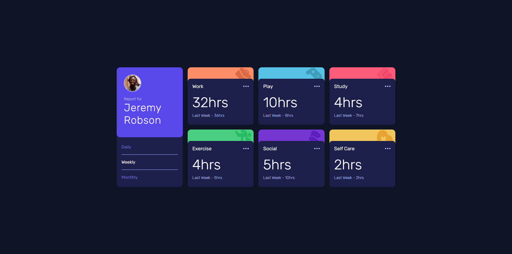
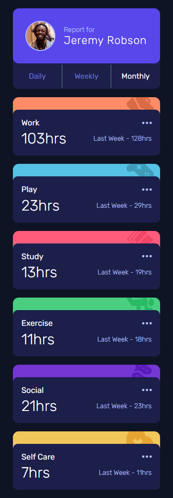

# Dashboard de seguimiento de tiempo

_"Este proyecto es una propuesta de solución para uno de los desafios de **Frontend Mentor**, todos los recursos utilizados fueron obtenidos mediante dicha plataforma"._

El proyecto mencionado contempla el diseño de una página mostrando un _dashboard_ acerca del seguimiento de tiempo de distintas tareas a traves del tiempo, especificamente comparando un periodo de tiempo actual con el anterior, el usuario puede elegir si mostrar el contenido según la día, semana o mes anterior.

## Contenidos

- [Descripcion](#descripción)
  - [Desafío](#desafío)
  - [Screenshot](#screenshot)
  - [Links](#links)
- [Proceso](#proceso)
  - [Hecho con](#hecho-con)
  - [Lo que aprendí](#lo-que-aprendí)

## Descripción

### Desafío

El desafío propuesto fue manejar de una manera eficiente el uso de un conjunto de datos dentro de un archivo JSON, en este caso, el archivo ```data.json``` posee la información de las tareas y las horas empleadas según el intervalo de tiempo. El objetivo principal fue mostrar el contenido dinamicamente y dejar a elección del usuario el intervalo de tiempo a comparar (Día/Semana/Mes).


### Screenshot

#### Escritorio


#### Movil


### Links

- Sitio: [Dashboard de seguimiento de tiempo](https://f-avalos.github.io/Time-Tracking-Dashboard/)

## Proceso

### Hecho con

- HTML
- CSS
  - Flexbox
  - Grid
  - Media Queries
  - Flujo de trabajo _Mobile-first_
- JavaScript
  - Manejo de DOM
  - Fetch / Async - Await

### Lo que aprendí

En este desafío aprendí a manejar elementos del DOM de manera eficiente, para posteriormente mostrar el contenido dinamicamente.

Siendo más específico, aprendí a obtener datos de un archivo .json mediante ```fetch()``` y utilizar conceptos como Async/Await para funciones asíncronas dentro de JavaScript.

Tambien aprendí a crear elementos dinámicos dentro de JavaScript para insertarlos en el documento HTML, de manera que el contenido es dinámico y no solo estático del documento base, funciones y atributos como ```document.createDocumentFragment()``` y ```document.innerHTML``` me ayudaron a mostrar el contenido desde JavaScript.